```mermaid
flowchart BT
CB_A((" ")) ===> A[/"Maintain[DoorsClosedWhileMoving]"/]
B[/"`Moving **Iff** NonZeroSpeed`"\]:::bold --- CB_A
DEF_C((" ")):::filled ===> C[/"Maintain[DoorsClosedWhileNonZeroSpeed]"/] --- CB_A

D[/"MeasureSpeed=PhysicalSpeed"/]:::bold --- DEF_C
E[/"`Maintain[DoorsStateClosed **If** NonZeroMesauredSpeed]`"/]:::bold ---DEF_C
F[/"`DoorsClosed **Iff** DoorsStateClosed`"/]:::bold --- DEF_C

G{{fa:fa-person SpeedSensor}} --- G_D((" ")) --- D
H{{TrainController}} --- H_E((" ")) --- E
I{{fa:fa-person DoorsActuator}} --- I_F((" ")) --- F

expectation:::nostroke -.- D
dp["domain property"]:::nostroke -.- B
ea["environment agent"]:::nostroke -.-G
sa["software agent"]:::nostroke -.- H

classDef bold stroke-width:3,stroke:#000
classDef filled fill:#000;
classDef nostroke stroke-width:0,fill-opacity:0.0
```

# Introduction
An alternative to using [draw.io](https://draw.io) or hand-drawing goal models is to use a flowchart diagram in
[Mermaid](https://mermaid.live/edit). You may:
1. Use the supplied `goalmodeling` Python package to generate refinement graphs viewable in Mermaid.
1. Use Mermaid's live editor to write diagram definitions.


## Using Python to generate refinement graphs
The `goalmodeling` Python package presents the concepts as objects. Below are the necessary prerequisites, how to download and install, how to get started, and a few examples.

### Prerequisites
* Python 3.10.5 or higher.

### Download
Download the latest goalmodeling wheel available under Releases.

### Install
Open a terminal and change the current working directory to where you downloaded the `goalmodeling` wheel file. Then install this wheel using pip3, as shown below.

```
pip3 install --no-index goalmodeling-0.1.1-py3-none-any.whl
``` 

### Getting started
Start an interactive `python3` session, and import `goalmodeling.schema`. Performing `dir(goalmodeling.schema)` lists available objects and functions in this package. 

```
>>> from goalmodeling.schema import *
>>> dir()
['AchieveGoal', 'Agent', 'AgentType', 'AvoidGoal', 'BehavioralGoal',
'BehavioralGoalType', 'CeaseGoal', 'ConflictLink', 'DomainProperty',
'Edge', 'EdgeType', 'Goal', 'GoalCategory', 'GoalType', 'IntEnum',
'MaintainGoal', 'NODE_COUNT', 'Obstacle', 'ObstructionLink', 'Operation',
'OperationCategory', 'PerformanceLink', 'Refinement', 'RefinementType',
'ResolutionLink', 'SoftGoal', 'SoftGoalType', 'Vertex', 'VertexType',
'__annotations__', '__builtins__', '__doc__', '__loader__', '__name__',
'__package__', '__spec__', 'diagram_startup', 'diagram_teardown',
'generate_graph', 'generate_pako_link']
```

For additional details, invoke `help(name)`, where `name` is the name of a specific object or function in `goalmodeling.schema`, for example, `help(AchieveGoal)`. Using the package to represent refinement graph constructs follows.


#### Refinement

The Refinement object represents a refinement of a goal or an obstacle. These are the small circles that appear on an edge between a parent goal and a child goal (or a parent obstacle and a child obstacle).

```python
Refinement(
    complete: bool,
    children: list[Vertex],
    annotation: str = '')
```

| Argument | Description |
|---------|----------|
| `complete` | Use `True` for a complete refinement, to produce a filled-in circle.|
|`children` | List of children forming an AND-relation. A child can be a goal, an obstruction, or a domain property. |
|`annotation`| Optionally label the refinement in the graph.

#### Performance links

Represents an agent performing an operation, which results in satisfying or satisficing a goal.

```python
 PerformanceLink(
    agent: Agent,
    operation: Operation)
 ```


#### Agents
Agents contribute to the satisfaction or satisficing of goals.

```python
Agent(
    name: str,
    agent_type: AgentType,
    annotation: str = '')
```

| Argument | Description |
|---------|----------|
| `name` | The name of the agent.|
|`agent_type` | The agent must either be environment agent or software agent, i.e., `AgentType.ENVIRONMENT_AGENT` or `AgentType.SOFTWARE_AGENT`, respectively.|
|`annotation`| Optionally label the agent in the graph.

Example:
```python
speed_sensor = Agent('SpeedSensor', AgentType.SOFTWARE_AGENT)
```

#### Operation

The agent performing the operation results in satisfying or satisficing the goal.

```python
Operation
    (name: str,
    category: OperationCategory,
    annotation: str = '')
```

| Argument | Description |
|---------|----------|
| `name` | The name of the operation. Markdown formatting is acceptable.|
|`category` | The operation must either be environment operation or a software to be operation, i.e., `OperationCategory.ENVIRONMENT_OPERATION` or `OperationCategory.SOFTWARE_TO_BE_OPERATION`, respectively.|
|`annotation`| Optionally label the operation.


#### Domain properties

Domain properties hold invariably regardless of how the system will behave.

```python
DomainProperty(
    name: str,
    leaf: bool = False,
    annotation: str = '')
```

| Argument | Description |
|---------|----------|
| `name` | The name of the domain property. Markdown formatting is acceptable.|
|`leaf` | Using `True` will bold the border of the domain property. |
|`annotation`| Optionally label the domain property.

#### Goals

Instantiate `AchieveGoal`, `AvoidGoal`, `MaintainGoal`, `CeaseGoal`, or `SoftGoal` instead of the more basic `Goal` or `BehavioralGoal` constructs. All goals have the following arguments.

| Argument | Description |
|---------|----------|
| `name` | The name of the goal. Markdown formatting is acceptable.|
|`performs` | An optional list of performance links representing agents and operations that cause the satisfaction or satisficing of this goal. Use `None` when not applicable, for example, for non-leaf goals. |
|`refinements` | A `list` of `Refinement` constructs producing an OR-relation among the members, where each `Refinement` represents AND-relationships, i.e., disjunctive normal form. Use `None` when a leaf goal. |
|`leaf`| If `True`, produce the parallelogram with a thick border. A thick border indicates a leaf goal.|
|`annotation`| Optionally label the goal. |

An example showing refinement of achievement goals follows.

```python
achieve_copyborrowed_if_available = AchieveGoal(
    name="CopyBorrowed **If** Available")

achieve_copyduesoonforcheckout_if_not_available = AchieveGoal(
    name="CopyDueSoonForCheckOut **If Not** Available")

achieve_book_request_satisfied = AchieveGoal(
    name="BookRequestSatisfied",
    performs=None,
    refinements=[Refinement(
        complete=False,
        children=[
            achieve_copyborrowed_if_available,
            achieve_copyduesoonforcheckout_if_not_available]
    )])


output = generate_graph([achieve_book_request_satisfied], [])
print(output)

config = {"theme": "default", "themeVariables": {"fontFamily": "Helvetica"}}
link = generate_pako_link(output, "edit", config)
print(link)
```

The produced Mermaid diagram definition output is:
```
flowchart BT
node3((" ")) ===> node4[/"`Achieve[BookRequestSatisfied]`"/]
node1[/"`Achieve[CopyBorrowed **If** Available]`"/] --- node3
node2[/"`Achieve[CopyDueSoonForCheckOut **If Not** Available]`"/] --- node3


classDef bold stroke-width:3,stroke:#000
classDef filled fill:#000;
classDef nostroke stroke-width:0,fill-opacity:0.0
```

The produced Mermaid link is:

> https://mermaid.live/edit#pako:eNp9kF9rwjAUxb_KJXvRYmembx0O_INsLxvMsRcrGJMbGpr2ujStiPjd17QvymDJQ8g55_5uci9MkkKWANOWTjITzsPiKy3LVp0MBimDlA2HMJvNXiBo0-04Zfu5zAw2uF0Q5Z_4U2PlN8KbShtUu33KxruewO_SSzqeF-QcnVBBFL3pKIJ5I4wVB4t9GcRx3PWZ9ICnP4BVjRuick1umaHMP2rfoeCd_P-4sKUVVbVCDQeyCirvKMf4ZJTPkumovyYPnPObpDbWts8NR2c933gl9TX3JD4K4ZiOQhp_TvgjD62hXWwErEBXCKPaiV-Yz7DoZq9Qi9r64Hfat3Am_KLqYppKvxaFseeQfUXboDdSsOv1-gt-Q5b7


The Mermaid graph is:

```mermaid
flowchart BT
node3((" ")) ===> node4[/"`Achieve[BookRequestSatisfied]`"/]
node1[/"`Achieve[CopyBorrowed **If** Available]`"/] --- node3
node2[/"`Achieve[CopyDueSoonForCheckOut **If Not** Available]`"/] --- node3


classDef bold stroke-width:3,stroke:#000
classDef filled fill:#000;
classDef nostroke stroke-width:0,fill-opacity:0.0
```


##### Achievement goals

```python
AchieveGoal(
    name: str,
    performs: list[PerformanceLink] = None,
    refinements: list[Refinement] = None,
    leaf: bool = False,
    annotation: str = ''
)
```

##### Avoidance goals

```python
AvoidGoal(
    name: str,
    performs: list[PerformanceLink] = None,
    refinements: list[Refinement] = None,
    leaf: bool = False,
    annotation: str = ''
)
```
##### Maintainenace goals

```python
MaintainGoal(
    name: str,
    performs: list[PerformanceLink] = None,
    refinements: list[Refinement] = None,
    leaf: bool = False,
    annotation: str = '')
)
```

##### Cease goals

```python
CeaseGoal(
    name: str,
    performs: list[PerformanceLink] = None,
    refinements: list[Refinement] = None,
    leaf: bool = False,
    annotation: str = '')
```

##### Soft goals
```python
SoftGoal(
    name: str,
    performs: list[PerformanceLink] = None,
    refinements: list[Refinement] = None,
    leaf: bool = False,
    annotation: str = '')
)
```

#### Conflict links

Represent a conflict between two goals, `goal1` and `goal2`, with a conflict link.

```
ConflictLink(
    goal1: Goal,
    goal2: Goal)
)
```


#### Obstacles

Define an obstacle node.

```python
Obstacle(
    name: str,
    refinements: list[Refinement] = None,
    annotation: str = '')
)
```

| Argument | Description |
|---------|----------|
| `name` | The name of the obstacle. Markdown formatting is acceptable.|
|`refinements` | A `list` of `Refinement` constructs producing an OR-relation among the members, where each `Refinement` represents an AND-relationship, i.e., disjunctive normal form. Use `None` when not applicable. |
|`annotation`| Optionally label the obstacle. |

#### Obstruction links

Tie an obstacle to a goal using an obstruction link.

```python
 ObstructionLink(
    goal: Goal,
    obstacle: Obstacle)
```

#### Resolution links

Tie the resolution of an obstacle with a goal using a resolution link.

```python
ResolutionLink(
    goal: Goal,
    obstacle: Obstacle)
```

#### Generating the refinement graph
Use `generate_graph` to output a Mermaid diagram definition for the refinement graph. The first argument `goals` is a list of root-level goals to include in the diagram definition. The second argument `links` is a list of obstruction links or conflict links associated with the goals to add to the diagram definition. The second argument is optional when there is no conflict or obstacle to represent. The returned output is a string.

```
generate_graph(
    goals: list[Goal],
    links: list[ObstructionLink or ConflictLink] = None) -> str
```

| Argument | Description |
|---------|----------|
| `goals` | A list of root-level goals. Often you may have just one root-level goal.|
|`links` | An optional list of obstruction links or conflict links. |


#### Generating a Mermaid link

Use `generate_pako_link` to generate a Mermaid link from the diagram definition produced by `generate_graph`.

```
generate_pako_link(
    text: str,
    mode: str = "view",
    config: dict = {"theme": "neutral"}) -> str
```

| Argument | Description |
|---------|----------|
| `text` | The diagram definition produced by `generate_graph`. |
| `mode` | Create a `"view"` link or `"edit"` link.|
| `config` | Additional Mermaid configuration. The `theme` field can be "default", "neutral", "forest", "dark", etc. Use the `themeVariables` field for additional configuration, for example, to change to a font containing lightning bolt (see [below](#lightning)). |


## Writing diagram definitions in Mermaid
The flowchart diagram in Mermaid can be used to represent refinement graphs. The syntax for flowchart diagrams is available under: https://mermaid.js.org/syntax/flowchart.html


### Simple Example
A flowchart definition in Mermaid for a simple refinement graph is shown below.
```
flowchart BT
refinement((" ")) ===> BookRequestSatisfied[/"`Achieve[BookRequestSatisfied]`"/]
CopyBorrowed[/"`Achieve[CopyBorrowed **If** Available]`"/] --- refinement
CopyDueSoonForCheckOut[/"`Achieve[CopyDueSoonForCheckOut **If Not** Available]`"/] --- refinement
```

This produces the following diagram.


### Preliminaries
1. Use `flowchart BT` as the starting line for the diagram.
1. The definition supports markdown, which can be used to emphasize particular text inside double-quotes. For example, ``GoalName[/"`GoalName **is** bold`"/]``.
1. Suffix the following styles to the definition. The `bold` style is used for leaf goals. The `filled` style is used for complete refinement. And the `nostroke` style is used for annotations.

```
classDef bold stroke-width:3,stroke:#000
classDef filled fill:#000;
classDef nostroke stroke-width:0,fill-opacity:0.0
```

> [!IMPORTANT]
> For refinement graphs, use `flowchart BT` as the starting line. 


### Refinements
Refinements are represented in the diagram as circles with no label: `refinement1((" "))`.
Use the filled style for complete refinements: `refinement1((" ")):::filled`.
The link is a thick edge with an arrow to the parent goal: `refinement1 ===> GoalName[/"GoalName"/]`.


### Goals
Goals are represented as right-leaning parallelograms: `GoalName[/"GoalName"/]`.
Subgoals are linked to refinements using a thin edge: `GoalName[/"GoalName"/] --- refinement1`.
Use the bold style for leaf refinements: `GoalName[/"GoalName"/]:::bold`.

### Domain Properties
Domain properties are represented as trapezoids: `DomainProperty[/"DomainProperty"\]`.

### Agents
Agents are represented as hexagons: `Agent{{"Agent"}}`.
For environment agents, use Font Awesome `fa:fa-person` for the fellow icon. For example,
`SpeedSensor{{fa:fa-person SpeedSensor}} --- MeasureSpeed` ties an agent SpeedSensor 
to some goal `MeasureSpeed`.

### Operations
Operations are represented as stadium shapes: `Operation(["Operation"])`.

### Conflicts
Use the lightning arrow to represent conflicts: `Goal1 --#128498;--- Goal2`. Note that exactly two hyphen characters must precede the lightning bolt character, and
at least three hyphen characters must follow the lightning bolt character.

<a name="lightning"></a>
> [!IMPORTANT]
> The font being used to render on your device may not have the Unicode lightning bolt character #128498, e.g., https://www.compart.com/en/unicode/U+1F5F2.
> Check https://www.fontspace.com/unicode/char/1F5F2-lightning-mood to see which fonts on your device support the lightning bolt character and use these for Mermaid by configuring `themeVariables`. For example,

```
{
  "theme": "default",
  "themeVariables": {
      "fontFamily": "Tahoma"
  }
}
```

### Obstructions
Use a line with a cross arrowhead to represent obstructions: `Obstruction ---x Goal2`.

### Annotations
Annotations are represented as rectangles with a `nostroke` style: `Annotation["Annotation"]:::nostroke`.

### Examples
#### Domain properties, maintenance goals, leaf goals, agents, and annotations
```
flowchart BT
CB_A((" ")) ===> A[/"Maintain[DoorsClosedWhileMoving]"/]
B[/"`Moving **Iff** NonZeroSpeed`"\]:::bold --- CB_A
DEF_C((" ")):::filled ===> C[/"Maintain[DoorsClosedWhileNonZeroSpeed]"/] --- CB_A

D[/"MeasureSpeed=PhysicalSpeed"/]:::bold --- DEF_C
E[/"`Maintain[DoorsStateClosed **If** NonZeroMesauredSpeed]`"/]:::bold ---DEF_C
F[/"`DoorsClosed **Iff** DoorsStateClosed`"/]:::bold --- DEF_C

G{{fa:fa-person SpeedSensor}} --- G_D((" ")) --- D
H{{TrainController}} --- H_E((" ")) --- E
I{{fa:fa-person DoorsActuator}} --- I_F((" ")) --- F

expectation:::nostroke -.- D
dp["domain property"]:::nostroke -.- B
ea["environment agent"]:::nostroke -.-G
sa["software agent"]:::nostroke -.- H

classDef bold stroke-width:3,stroke:#000
classDef filled fill:#000;
classDef nostroke stroke-width:0,fill-opacity:0.0
```

This produces the following diagram.

